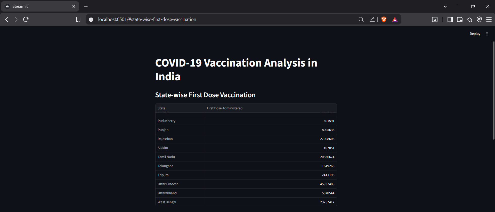
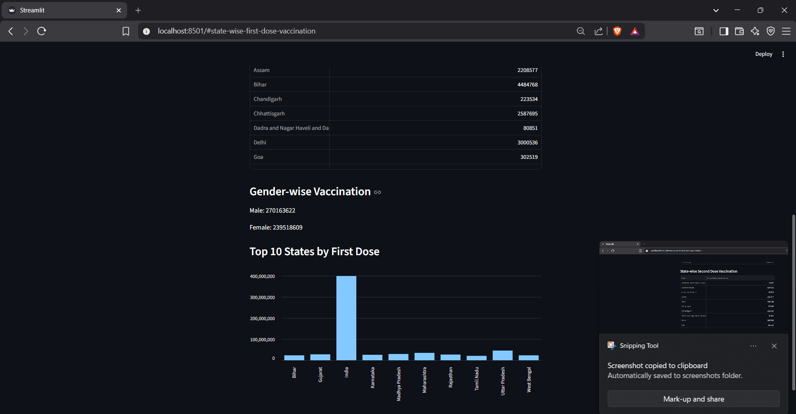
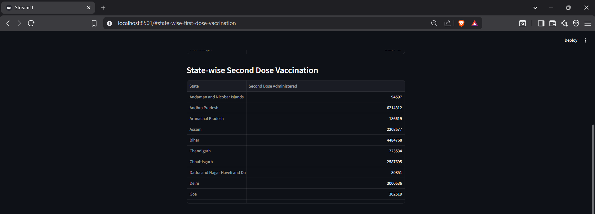

# DSBDA-Project-1---Vaccine-Analysis
📊 COVID-19 Vaccination Analyzer (India)
📌 Overview

The COVID-19 Vaccination Analyzer is a data analysis project that explores vaccination trends across different states in India. It uses real-world data to provide insights into first dose, second dose, and gender-wise vaccination distribution. The project also includes a Streamlit-based web application for interactive visualization.

🚀 Features

📍 State-wise First Dose Analysis
📍 State-wise Second Dose Analysis
👨 Male Vaccination Insights
👩 Female Vaccination Insights
📊 Data Visualization using charts
🌐 Interactive dashboard using Streamlit

🛠️ Tech Stack

Language: Python
Libraries: Pandas, NumPy
Visualization: Matplotlib
Web App: Streamlit

📂 Project Structure
CovidVaccineProject/
│
├── app.py
├── vaccine_analysis.py
├── covid_vaccine_statewise.csv
├── requirements.txt
└── README.md
⚙️ Installation & Setup
1. Clone the repository
git clone https://github.com/your-username/covid-vaccine-analyzer.git
cd covid-vaccine-analyzer
2. Install dependencies
pip install pandas numpy matplotlib streamlit
3. Run the application
streamlit run app.py

📊 How It Works
Dataset is loaded and cleaned using Pandas
Data is grouped state-wise for analysis
Cumulative values are used for accurate totals
Results are displayed using charts and tables
Streamlit provides an interactive UI

🎯 Objectives
Analyze COVID-19 vaccination progress in India
Compare state-wise vaccination performance
Study gender-based vaccination distribution
Build a beginner-friendly data analytics project

📸 Screenshots

🔮 Future Improvements
Add filters (state, date range)
Improve UI design
Add more advanced visualizations
Deploy fully on cloud

👨‍💻 Author

Swanand Pande

📜 License

This project is for educational purposes.
